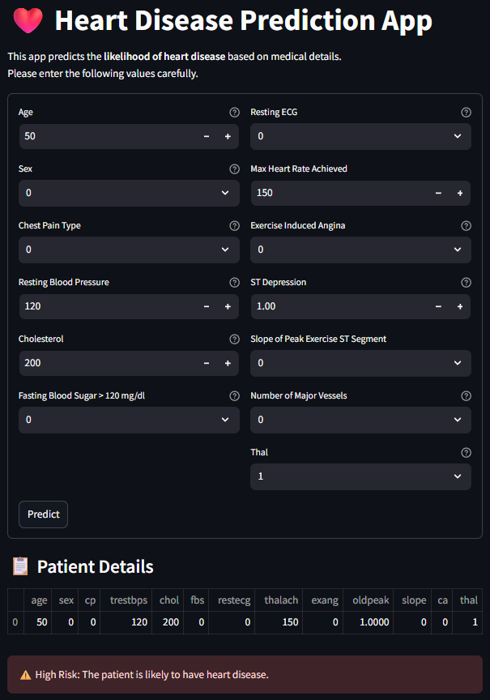

# ❤️ Heart Disease Prediction App  

This is a **Machine Learning-based web application** built using **Streamlit** that predicts whether a person is likely to have **heart disease** or not.  
The prediction is based on several medical input features such as age, cholesterol level, blood pressure, maximum heart rate, and more.  

This project is a part of my **Machine Learning learning journey**, where I applied concepts like **data preprocessing, train-test split, model training, and deployment**.  

---

## 📊 Features  

✔️ **User-Friendly Interface** – Enter patient details through input fields & sliders.  
✔️ **Prediction with ML Model** – Uses a trained **Logistic Regression / Random Forest** model.  
✔️ **StandardScaler Integration** – Ensures input data is scaled properly before prediction.  
✔️ **Interactive Web App** – Powered by **Streamlit** for real-time prediction.  
✔️ **Free Deployment** – Runs seamlessly on **Streamlit Cloud**, accessible via web browser.  

---

## 📂 Repository Structure

```
📦 Heart-Disease-prediction-app
│── heart_app.py                # Streamlit app frontend
│── heart_model.pkl    # Trained ML model
│── requirements.txt      # Dependencies for deployment
│── README.md             # Project documentation
```


---

## ⚙️ Installation & Usage

### 🔹 Step 1: Clone the repository

```bash
git clone https://github.com/abdulwasay8905/Heart_Disease_Prediction-Web-App.git
cd Heart_Disease_Prediction-Web-App
```

### 🔹 Step 2: Install required dependencies

```bash
pip install -r requirements.txt
```

### 🔹 Step 3: Run the Streamlit app locally

```bash
streamlit run app.py
```
📌 App will be available at:
👉 `https://heartdiseasepredictionwebappbyabdul.streamlit.app`

---

## 🌍 Deployment on Streamlit Cloud

This app is deployed for **free** on [Streamlit Community Cloud](https://streamlit.io/cloud).

🔹 Deployment Steps:

1. Push the repository to **GitHub**.
2. Log in to [Streamlit Cloud](https://streamlit.io/cloud).
3. Click **New App** → select repo → branch → app file (`app.py`).
4. Add `requirements.txt` for dependencies.
5. Deploy & get a **public URL** 🌍.

---

## 📦 requirements.txt

```txt
streamlit==1.37.0
pandas==2.2.2
numpy==1.26.4
scikit-learn==1.3.2
joblib==1.4.2
```

---

🧑‍💻 How it Works
1. User enters their health details like age, blood pressure, cholesterol, and max heart rate.
2. The data is trained using the model Logistic Regression.
3. The trained ML model predicts the result.
4. The app shows whether the person is likely to have Heart Disease: Yes / No.

---

## 📸 Demo



---

## 👨‍💻 Author

**Abdul Wasay**

## 📬 Connect with Me  

[](https://github.com/your-abdulwasay8905)
[](www.linkedin.com/in/abdul-wasay-2a602329b)
[](mailto:wasay8892@gmail.com)

---
